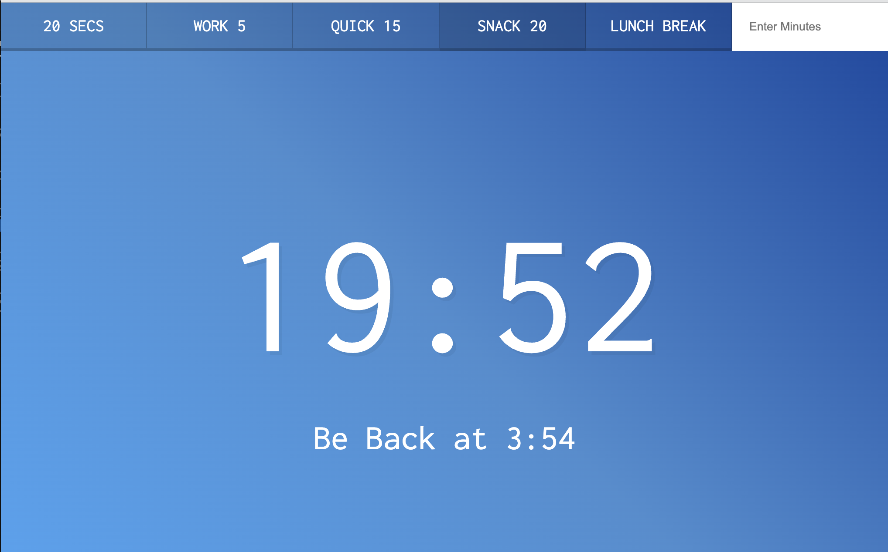

# Countdown_timer
This is a 30-days javascript grinding  
js30 [https://github.com/ningh98/js30]  
29. Countdown_timer [https://github.com/ningh98/Countdown_timer]

## Table of contents

- [Overview](#overview)
  - [Screenshot](#screenshot)
  - [Links](#links)
- [My process](#my-process)
  - [Built with](#built-with)
  - [What I learned](#what-i-learned)


## Overview

This code implements a countdown timer using JavaScript and DOM manipulation. The script allows users to set a timer for a specified number of seconds by either clicking predefined buttons or entering a custom time in minutes through a form. It dynamically updates the webpage to display the time remaining and the time when the countdown will end.

### Screenshot




### Links

- Live Site URL: [https://ningh98.github.io/Countdown_timer/]

## My process

### Built with

- HTML
- CSS
- Javascript


### What I learned


```js

let countdown
const timeDisplay = document.querySelector('.display__time-left')
const endTime = document.querySelector('.display__end-time')
const buttons = document.querySelectorAll('[data-time]')

function timer(seconds){
    clearInterval(countdown)
    const now = Date.now()
    const then = now + seconds * 1000
    displayTimeLeft(seconds)
    displayEndTime(then)

    countdown = setInterval(() => {
        const secondsLeft = Math.round((then - Date.now()) / 1000)
        if(secondsLeft < 0){
            clearInterval(countdown)
            return
        }
        displayTimeLeft(secondsLeft)
    }, 1000)
}

function displayTimeLeft(seconds){
    const minutes = Math.floor(seconds / 60)
    const remainderSeconds = seconds % 60
    const display = `${minutes}:${remainderSeconds < 10 ? `0` : ``}${remainderSeconds}`
    document.title = display
    timeDisplay.textContent = display
    
}

function displayEndTime(timestamp) {
    const end = new Date(timestamp)
    const hour = end.getHours()
    const minutes = end.getMinutes()
    endTime.textContent = `Be Back at ${hour > 12 ? hour -12 : hour}:${minutes < 10 ? `0` : ``}${minutes}`
}

function startTimer(){
    const seconds = parseInt(this.dataset.time)
    timer(seconds)
}

buttons.forEach(button => button.addEventListener('click', startTimer))
document.customForm.addEventListener('submit', function(e){
    e.preventDefault()
    const mins = this.minutes.value
    timer(mins * 60)
    this.reset()
})

```
